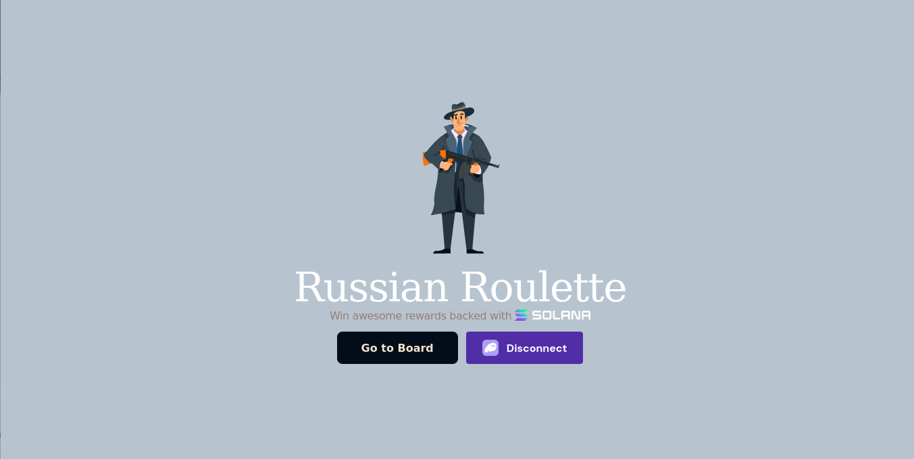
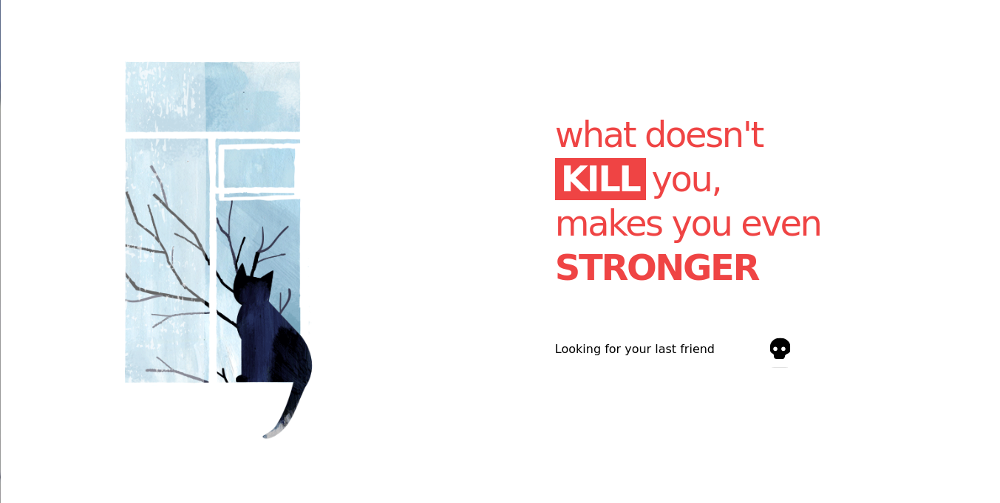
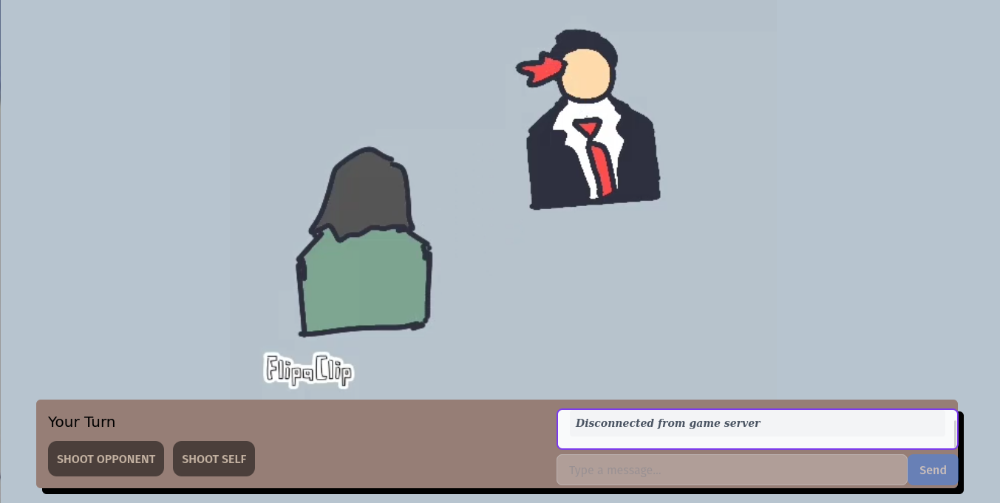

# LUCKSHOT ROULETTE

Luckshot Roulette is a thrilling two-player Web3 game based on Solana, where players take turns to shoot themselves or their opponent using a revolver with 5 empty chambers and 1 bullet. The high stakes make it even more intense—both players bet 0.01 SOL, and the survivor takes it all!

---

## Features

- **Two-player gameplay**: Challenge an opponent in a game of luck and skill.
- **Blockchain integration**: Powered by Solana for secure transactions and decentralized gameplay.
- **High stakes betting**: Players bet 0.01 SOL each; the winner takes home the pot.
- **Real-time interactions**: Leveraging WebSocket communication for seamless gameplay.

---

## Tech Stack

1. **Frontend**: React (Next.js)
2. **Blockchain**: Solana & Anchor for smart contract development
3. **Backend**:
   - Rust (Actix) for WebSocket-based gameplay logic
   - Go (Gorilla WebSocket) for matchmaking and real-time player communication

---

## Getting Started

Follow these steps to set up Luckshot Roulette locally:

### Prerequisites

1. Install [Node.js](https://nodejs.org/).
2. Install [Rust](https://www.rust-lang.org/tools/install).
3. Install [Go](https://go.dev/dl/).
4. Install [Solana CLI](https://docs.solana.com/cli/install-solana-cli-tools).
5. Install [Anchor CLI](https://book.anchor-lang.com/getting_started/installation.html).
6. Ensure `npm`, `cargo`, and `go` are added to your PATH.

### Step 1: Clone the Repository

```bash
$ git clone https://github.com/your-repo/luckshot-roulette.git
$ cd Luck-Shot
```

### Step 2: Set Up the Frontend

1. Navigate to the frontend directory:
   ```bash
   $ cd client
   ```
2. Install dependencies:
   ```bash
   $ npm install
   ```
3. Set up environment variables in `.env.local` (see `.env.example`).
4. Start the development server:
   ```bash
   $ npm start
   ```

### Step 3: Deploy the Anchor Program

1. Navigate to the Solana program directory:
   ```bash
   $ cd roulette-program
   ```
2. Build the program:
   ```bash
   $ anchor build
   ```
3. Deploy the program to the Solana Devnet:
   ```bash
   $ anchor deploy
   ```
4. Note the deployed program ID and update it in the frontend `.env.local` file.

### Step 4: Start the WebSocket Server

1. Navigate to the Go server directory:
   ```bash
   $ cd gorilla-socket
   ```
2. Build the server:
   ```bash
   $ go build
   ```
3. Run the server:
   ```bash
   $ ./go_socket
   ```

### Step 5: Start the Rust Backend

1. Navigate to the Rust server directory:
   ```bash
   $ cd socket-backend
   ```
2. Build the server:
   ```bash
   $ cargo build
   ```
3. Run the server:
   ```bash
   $ cargo run
   ```

---

## Game Workflow

1. **Player Matchmaking**:
   - Player One joins the queue.
   - Player Two connects and starts a match.
2. **Betting**:
   - Both players deposit 0.01 SOL.
3. **Gameplay**:
   - Players take alternate turns to fire.
   - The revolver has 5 empty chambers and 1 loaded chamber.
4. **Winning**:
   - The survivor wins the accumulated SOL.

---

## Screenshots




